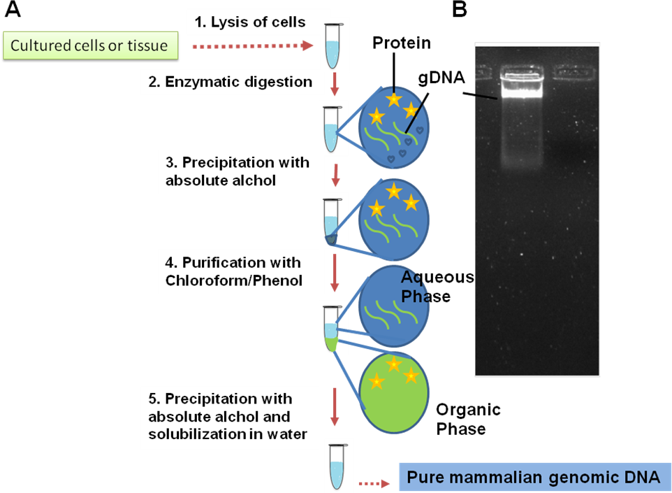
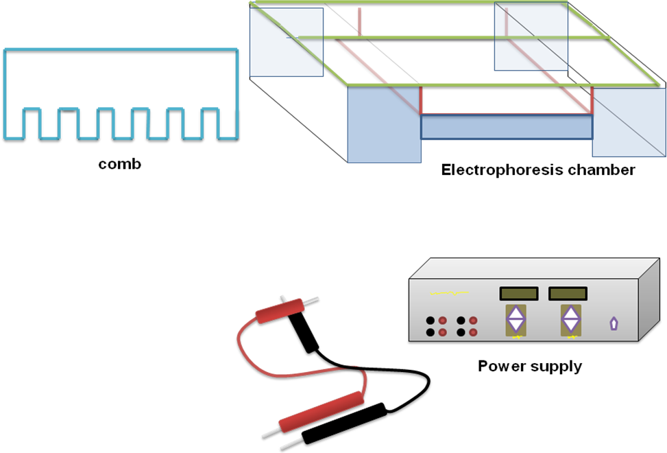
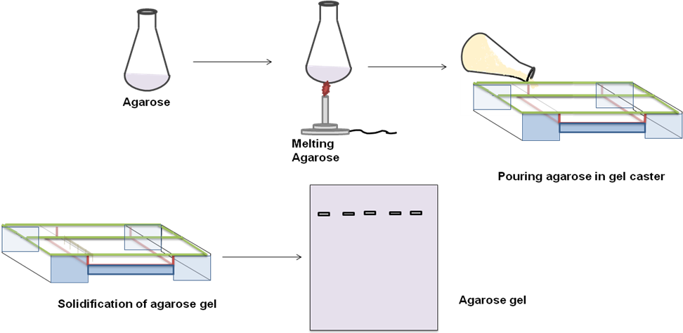
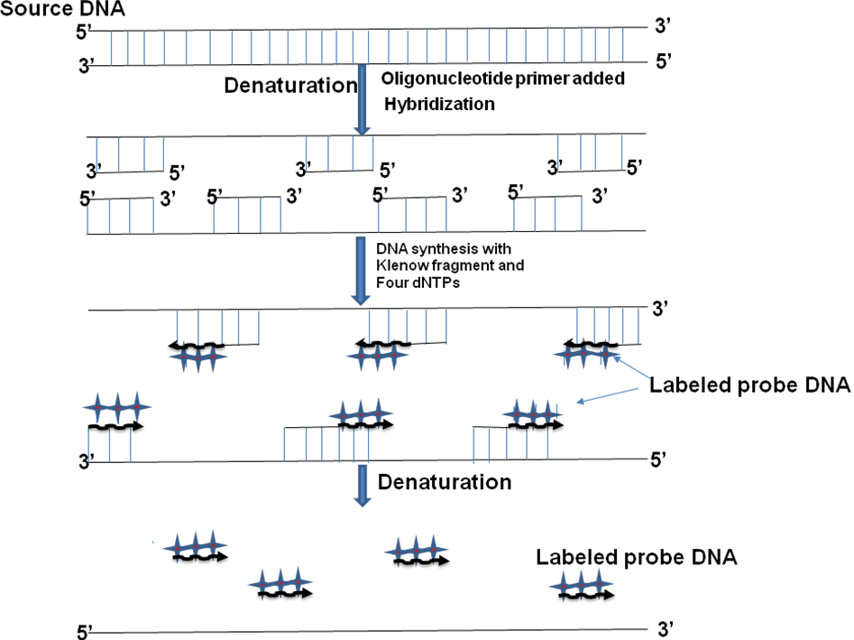
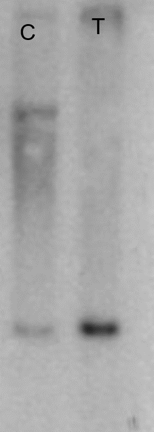

### Procedure

### Step 1: Genomic DNA isolation

The schematic for genomic DNA isolation is shown in Figure 2.

1. Lysis of cells with detergent containing lysis buffer.
2. Incubation of cells with digestion buffer containing protease-K, SDS to release genomic DNA from DNA-protein complex.
3. Isolation of genomic DNA by absolute alcohol precipitation.
4. Purification of genomic DNA with phenol:chloroform mixture. Chloroform:phenol mixture has two phases, aqueous phase and organic phase. In this step, phenol denatures the remaining proteins and keep the protein in the organic phase.
5. Genomic DNA present in aqueous phase is again precipitated with absolute alcohol.
6. Genomic DNA is analyzed on 0.8% agarose gel and a good preparation of genomic DNA give an intact band with no visible smear.

<b>Figure 2: Genomic DNA purification</b>

### Step 2: Generation of suitable size fragments

**Restriction digestion of genomic DNA:**

Genomic DNA can be digested with a frequent DNA cutting enzyme such as EcoR-I, BamH-I or Sau3A to generate the random sizes of DNA fragments. The criteria to choose the restriction enzyme or pair of enzymes in such a way so that a reasonable size DNA fragment will be generated. As fragments are randomly generated and are relatively big enough, it is likely that each and every genomic sequence is presented in the pool.

1. Digest 10-20 µg of the genomic DNA with EcoRI (2-3 unit for each µg genomic DNA) overnight in the presence of appropriate buffer and BSA (if required). The reaction mixture of restriction digestion is given in Table 1.
2. Take out a small aliquot from the restriction digestion reaction and check on 0.8% agarose gel. The appearance of a smear with visible bands indicates complete digestion of genomic DNA and the suitability of the sample for Southern blotting.

### Table 1: Reaction mixture to set up the restriction digestion of genomic DNA

| Reagents | Amount required |
| -------- | --------------- |
| Vector Insert Vector : Insert = 1:3 | 1 µg 3 µg |
| T4-DNA Ligase | 0.5-10 units per reaction |
| Ligase Buffer (10x) | 1x |
| BSA (100x) | 1x |
| Sterile Water | To make up the volume |
| **Total Volume** | **20 µl** |

Reactions are incubated 16-20 hrs at 16 °C.

### Step 3: Separation of DNA on agarose gel

**Buffers and Reagents:**

The purpose of each reagent used in horizontal gel electrophoresis are as follows-

1. Agarose- polymeric sugar used to prepare horizontal gel for DNA analysis.
2. Ethidium bromide- for staining of the agarose gel to visualize the DNA.
3. Sucrose- for preparation of loading dye for horizontal gel.
4. Tris-HCl- the component of the running buffer.
5. Bromophenol blue- tracking dye to monitor the progress of the electrophoresis.

#### 3.1 Horizontal Gel Electrophoresis

1. Horizontal gel electrophoresis is used to resolve the DNA. Different components of horizontal gel electrophoresis is given in Figure 3. The electrophoresis chamber has two platinum electrodes placed on the both ends are connected to the external power supply from a power pack which supplies a direct current or DC voltage.
2. The tank filled with the running buffer and the gel casted is submerged inside the buffer.
3. There are additional accessories needed for casting the agarose gel such as comb (to prepare different well), spacer, gel caster etc.

<b>Figure 3: Different components of the horizontal Gel Electrophoresis Apparatus</b>

**Casting of the agarose gel-**

1. Different steps to cast the agarose gel for horizontal gel electrophoresis are given in Figure 4.
2. The agarose powder is dissolved in a buffer (TAE or TBE) and heated to melt the agarose.
3. Hot agarose is poured into the gel cassette and allowed it to set.
4. A comb can be inserted into the hot agarose to cast the well for loading the sample.
5. In few cases, we can add ethidium bromide within the gel so that it stains the DNA while electrophoresis.

<b>Figure 4: Casting of Agarose Gel for Electrophoresis</b>

### Step 5: Preparation of radiolabeled probe

**Random primer method:** In this method, a random primer is used to anneal to the template and then a PCR reaction is performed in the presence of radiolabeled nucleotide (Figure 5). After PCR, newly synthesized DNA strand is labeled with radioactive nucleotide. It has following steps:

1. The source double stranded DNA is denatured to generate the single stranded DNA template.
2. A random primer is added and allowed it to anneal to the template strand. It will anneal to the random position throughout the sequence at multiple places.
3. Primer will anneal to the template strand and now Klenow will start the synthesis of new DNA strand.
4. Newly synthesized DNA will give short stretches of multiple labeled DNA probes.

<b>Figure 5: Preparation of radioactive probe by random primer method.</b>

### Step 6: Hybridization and development

1. Place the membrane in a hybridization tube and pre-hybridize in 10-20 ml hybridization solution at 65 °C for at least 30 mins.
2. Preparation of probe for hybridization: denature the probe by boiling for 10 mins and quench on ice.
3. Add the probe to the hybridization solution and incubate overnight. Use high temperature (~65 °C) for high stringency or moderate temperature (50-55 °C) for low stringency conditions.
4. Rinse the membrane thoroughly with 10 ml of washing solution 2xSSC containing 0.1% SDS at room temperature.
5. Expose the membrane to an x-ray film with an intensifying screen.

**Result:** In the Southern blotting, the restriction enzyme cuts genomic DNA with a gene-specific probe, indicating a single band in the sample (Figure 6). A single band within a Southern blot indicates the presence of a single copy of the gene in the genome. More study is required to verify the results from the Southern blotting.

<b>Figure 6: Developed Southern blot.</b> The radioactive probe hybridizes with target gene to the genomic fragments and give intense band.

