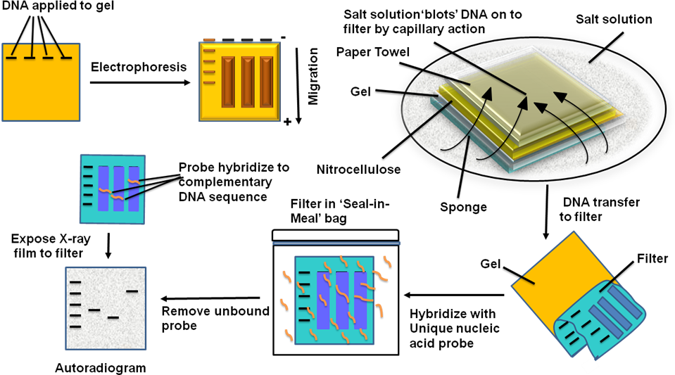

In Southern blotting, the genomic DNA is digested with the EcoRI or BamHI and the DNA fragments are resolved on the agarose gel. The gel is incubated in an alkaline solution to denature the double-stranded DNA to a single-stranded form. DNA is transferred to the nitrocellulose membrane by capillary action, either by applying suction or by placing wet paper towels. The membrane is incubated with a non-specific DNA, such as sonicated calf thymus genomic DNA, to block the binding sites on the membrane. A single stranded radioactive probe is added to the membrane and allowed to bind. The membrane is washed, and the blot is developed by autoradiography. The DNA fragment complementary to the probe sequence binds the radioactive probe and give positive signal.

It is a six-step technique for resolving genomic DNA fragments and detecting a specific gene to determine copy number of a particular gene in the genome. The details of each step is given in the procedure, but a schematic outline of these steps is given in Figure 1. It is as follows:

<b>Figure 1: General overview of different steps in Southern Blotting.</b>

1. In the first step, cells are isolated from the cell culture plate, and genomic DNA is isolated. The quality of genomic DNA was checked on 0.8% agarose gel. It must be free from degradation.
2. Genomic DNA was digested with restriction enzymes (BamH-I, EcoR-I, or Hind-III) to generate suitable-sized DNA fragments.
3. DNA fragments were separated on high resolution agarose gel.
4. DNA fragments from agarose gel were transferred onto a nitrocellulose membrane. The transfer of DNA can be checked by a UV transilluminator.
5. Nitrocellulose membrane was blocked with non-specific DNA to avoid binding of the probe to the nitrocellulose surface. A radioactive probe was prepared, and the membrane was incubated with it in the hybridisation chamber.
6. The membrane was washed with the washing buffer to remove excess probe.
7. Nitrocellulose membrane was incubated with photographic film for 48 hours at -80 °C. Exposure can be optimized based on the radioactive signal from the bound probe.
